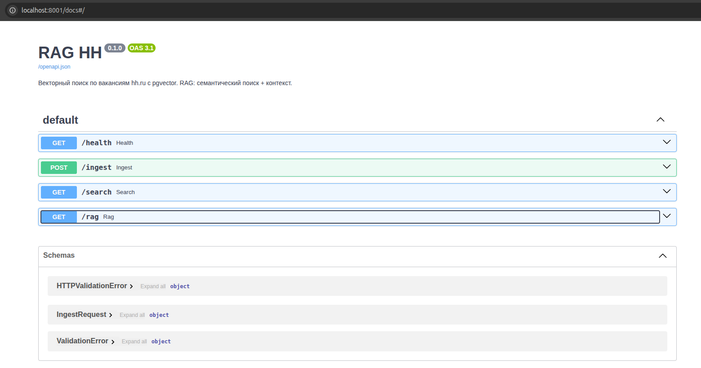

# Документация RAG HH

Подробные руководства по технологиям проекта и по самой разработке. Материал рассчитан на то, что вы хотите не просто запустить проект, но и уверенно разбираться в векторном поиске, pgvector и RAG.

---

## Как читать документацию

Рекомендуемый порядок для «с нуля»:

| № | Документ | О чём |
|---|----------|--------|
| 1 | [Эмбеддинги 101](01-embeddings-101.md) | Что такое эмбеддинги, как выбирать модели, размерность, best practices |
| 2 | [pgvector 101](02-pgvector-101.md) | Векторный поиск в PostgreSQL: типы, операторы, индексы IVFFlat/HNSW |
| 3 | [RAG 101](03-rag-101.md) | Retrieval-Augmented Generation: идея, пайплайн, практические советы |
| 4 | [Архитектура проекта](04-project-architecture.md) | Как устроен RAG HH: компоненты, поток данных, API |
| 5 | [hh.ru API и индексация](05-hh-api-and-ingest.md) | Загрузка вакансий, подготовка текста под эмбеддинги |
| 6 | [Docker и эксплуатация](06-docker-and-operations.md) | Запуск, переменные окружения, типичные задачи |
| 7 | [RAG Tutorial (полный)](07-rag-tutorial-full.md) | Этапы разработки, расстояние векторов, топ из RAG, backend/frontend, таблица embedding |

Если вы уже знакомы с одной из тем — переходите к нужному файлу по оглавлению выше.

---

## Краткий глоссарий

- **Эмбеддинг** — вектор чисел, представляющий смысл текста (или запроса). Похожие по смыслу тексты дают близкие векторы.
- **pgvector** — расширение PostgreSQL для хранения векторов и поиска «ближайших соседей» (k-NN).
- **RAG** — подход: сначала поиск релевантных документов (retrieval), затем генерация ответа по ним (augmented generation), часто с помощью LLM.
- **IVFFlat / HNSW** — типы индексов в pgvector для ускорения приближённого поиска по векторам.
- **Cosine similarity** — мера близости векторов по направлению (в проекте используется для семантического поиска).

---

## Ссылки на внешние ресурсы

- [pgvector на GitHub](https://github.com/pgvector/pgvector)
- [Sentence Transformers](https://www.sbert.net/)
- [HeadHunter API](https://dev.hh.ru/)
- [FastAPI](https://fastapi.tiangolo.com/)
